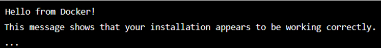

# Atividade 1: Turtlesim: simulando um ambiente robótico integrado no ROS

## Enunciado

Crie um script em Python capaz de interagir com o nó de simulação do turtlesim e enviar mensagens nos tópicos que regem a locomoção da tartaruga principal. Utilize este script para reproduzir um desenho de sua autoria. Utilize a estrutura de dados que preferir para representar a “imagem” a ser desenhada. O uso de programação orientada a objetos é obrigatório.

## Padrão de qualidade

Para esta atividade, espera-se a capacidade demonstrável de interagir com o sistema operacional de robôs, criando um nó de comunicação com uma solução pré-existente. A entrega deve ser um vídeo demonstrando o funcionamento do projeto, um texto conciso descrevendo como foi feita a implementação e o link para o repositório público no github onde foi feita a implementação.

Ao terminar esta atividade, espera-se que os estudantes consigam validar suas instalações locais do ambiente de desenvolvimento que será utilizado ao longo do semestre. A nota para esta atividade segue os critérios estabelecidos pelo Inteli e pode ser dividida em: 
- Configuração adequada do ambiente de desenvolvimento ROS;
- Funcionamento correto do script de interação com o turtlesim;
- Explicação coerente e concisa da implementação;
- Congruência entre o que foi escrito e o código disposto no repositório do github;

## Instruções:

### Instalação do WSL

Antes de mais nada, certifique-se que o módulo de Windows do WSL foi habilitado (versões mais novas do Windows já vem com o módulo habilitado). Para isso, abra o PowerShell com privilégios administrativos e execute o seguinte comando:

```powershell
dism.exe /online /enable-feature /featurename:Microsoft-Windows-Subsystem-Linux /all /norestart
```

Esse comando faz alterações que requerem a reinicialização do sistema. Reinicie o computador antes de continuar.

Para garantir que a versão do WSL no seu computador é a mais atualizada possível, utilize o comando a seguir:
```powershell
wsl --update
```

A seguir, procure na Microsoft Store por `Ubuntu 22.04`, pois essa é a distribuição adequada para utilizar com o ROS Humble. Para instalá-la, basta clicar no botão "Obter" e aguardar a conclusão da instalação. Ao terminar instalação inicial, um terminal será aberto solicitando que faça as configurações iniciais do seu sistema Ubuntu. ***Não pule esta etapa***, pois é nela que o sistema criará a pasta HOME do seu usuário e o configurará como a conta padrão e pertencente ao grupo de usuários que podem usar o comando `sudo`.

Parabéns! Agora você tem uma versão de Ubuntu instalada dentro do conforto de seu sistema Windows =)

Mas calma, ainda não acabou. Antes de pularmos para a instalação do ROS, vamos rodar alguns comandos que vão garantir que seu Ubuntu está preparado para o desenvolvimento que faremos a seguir.

Primeiro, vamos atualizar o banco de dados de repositórios do apt com:
```bash
sudo apt update
```

A seguir, vamos atualizar todas as aplicações que não estão em sua versão mais nova com:
```bash
sudo apt upgrade
```

Pronto, agora vamos instalar alguns pacotes que vão ser importantes para nosso desenvolvimento. Para começar, vamos instalar um metapacote que agrega as ferramentas necessárias para compilação e desenvolvimento de software. Rode:
```bash
sudo apt install build-essential
```

Agora, vamos garantir que tudo o que vamos precisar de Python está no sistema. Rode:
```bash
sudo apt install python3 python3-pip python3-venv
```

Agora sim! Tudo certo para começarmos a instalação do ROS.

### Instalação do ROS2 Humble

- Abra a distribuição Linux instalada no passo 2.
- Abra um terminal na distribuição Linux.
- Execute os seguintes comandos:

```sudo apt update```

```sudo apt install -y apt-transport-https ca-certificates curl gnupg lsb-release```

```curl -fsSL https://download.docker.com/linux/ubuntu/gpg | sudo gpg --dearmor -o /usr/share/keyrings/docker-archive-keyring.gpg```

```echo "deb [arch=amd64 signed-by=/usr/share/keyrings/docker-archive-keyring.gpg] https://download.docker.com/linux/ubuntu $(lsb_release -cs) stable" | sudo tee /etc/apt/sources.list.d/docker.list > /dev/null```

```sudo apt update```

```sudo apt install -y docker-ce docker-ce-cli containerd.io```

```sudo usermod -aG docker $USER```

- Feche e abra novamente o terminal para aplicar as alterações.
- Abra o terminal na distribuição Linux.
- Execute o seguinte comando: 

```docker run hello-world```

- Se tudo estiver funcionando corretamente, você deverá ver uma saída similar a esta:



- Abra um terminal e execute o seguinte comando: 

```docker pull ros:foxy```

- Aguarde o download da imagem do ROS2 ser concluído. Isso pode levar alguns minutos, dependendo da velocidade da sua conexão com a Internet.

Agora, para criar um container com o ROS2 e o TurtleBot, abra um terminal e execute o seguinte comando:

```docker run -it --name my_turtlebot --privileged --env="DISPLAY" --env="QT_X11_NO_MITSHM=1" --volume="/tmp/.X11-unix:/tmp/.X11-unix:rw" ros:foxy /bin/bash```

- Este comando cria um novo container chamado "my_turtlebot" com o ROS2 instalado e o ambiente gráfico configurado para exibir a interface do TurtleBot.

- Para instalar o pacote do TurtleBot, no terminal do container, execute o seguinte comando: 

```apt update && apt install -y ros-foxy-turtlebot3 ros-foxy-turtlebot3-simulations```

- Aguarde a instalação dos pacotes ser concluída.

- Para testar o TurtleBot, no terminal do container, execute os seguintes comandos:

```source /opt/ros/foxy/setup.bash```
```export TURTLEBOT3_MODEL=burguer```
```roslaunch turtlebot3_gazebo turtlebot3_world.launch```

- Este comando lança uma simulação do ambiente do TurtleBot no Gazebo.
- Abra um novo terminal e execute os seguintes comandos:

```source /opt/ros/foxy/setup.bash```
```export TURTLEBOT3_MODEL=burguer```
```roslaunch turtlebot3_teleop turtlebot3_world.launch```

- Este comando lança um teleop para controlar o robô simulado no ambiente do TurtleBot. Use as teclas de seta para mover o robô simulado pelo ambiente do TurtleBot.
- Se tudo estiver funcionando corretamente, você deverá ver a interface gráfica do TurtleBot no seu computador e poderá controlar o robô simulado.
